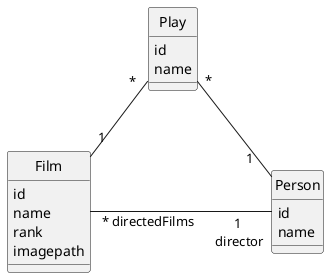

## Test PlantUML

```plantuml
@startuml component

class Play {
  id
  name
}

class Film {
  id
  name
  rank
  imagepath
}

class Person {
  id
  name
}

Play "*"  -- " 1   " Person
Play " * "  -- "1" Film

Film " * directedFilms" - "1 \ndirector" Person :"                                           "
hide circle

@enduml

```

